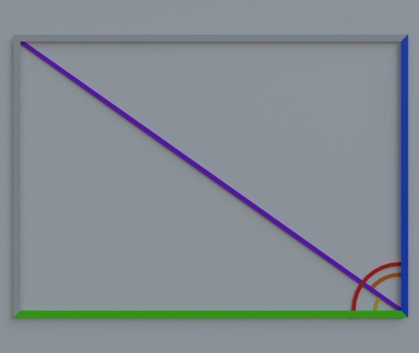

# Geometria

"Geometria" is a program to help to calculate basic parameters in simple figures :ballot_box_with_check:

<div style="text-align:center">
  
</div>
<!---->

___
## Short describtion and methods:
SDK: *corrnetto 11*;

---
### The head class `HelpingMethods`:
1. ```public double quadraticEducation(double a, double b, double c)``` - This is a function that calculates the root of a quadratic equation of the form `ax^2 + bx + c = 0` using the discriminant and variables.

```Return value```:
  + Returns the root of an equation if it exists and is positive;
  + If the discriminant is less than 0, the function will return -1 and display the message "Discriminant less than 0";
  + If the roots are negative, the function will also return -1 and display an error message.

2. ```public double round(double x, int dozen)``` - this is a function that rounds a number to a given tenth.
  + ```Variables```:
    + ```double x``` - the number to be rounded;
    + ```int dozen``` - the tenth to which the number should be rounded. Must be in the range -9 to 9.
  + ```Return value```:
    + Returns a number rounded to the specified tenth;
    + If the value of the dozen parameter is outside the range from -9 to 9, the function will display the message "Out of range" and return -1.
3. ```public double pythagoreanTheorem(double a, double b, char action)``` - this is a function that implements the Pythagorean theorem to calculate the length of the hypotenuse of a triangle or the difference of the legs depending on the specified operation.
  + ```Variables```:
    + ```double a``` - length of the first leg of the triangle;
    + ```double b``` - length of the second leg of the triangle;
    + ```char action``` - the operation to be performed. Can be '+' (to calculate the hypotenuse) or '-' (to calculate the difference between the legs).
  + ```Return value```:
    + Returns the result of an operation depending on the specified action;
    + If action is not '+' or '-', the function will print the message "Enter correct parameter." and will return -1.
4. ```public double pythagoreanTheorem(double a, char action)``` - this is a function that applies the Pythagorean theorem to calculate either the length of the hypotenuse of a triangle (the sum of the squares of the legs) or the difference of the legs, depending on the specified operation.
  + ```Variables```:
    + ```double a``` - the length of one of the legs of the triangle;
    + ```char action``` - The operation to be performed. Can be '+' (to calculate the length of the hypotenuse) or '-' (to calculate the difference between the legs).
  + ```Return value```:
    + Returns the result of an operation depending on the specified action;
    + If action is not '+' or '-', the function will print the message "Enter correct parameter." and will return -1.
---

### The package `rectangle`:
#### The 2D figures:
#### The head class ```Rectangle```:

<span style="color: blue;"><div style="text-align:center;">Designation of colors in a figure:</div></span>
<div style="text-align:center;">
  <span style="color: none;">double</span>
  <span style="color: blue;">width;</span>
</div>
<div style="text-align:center;">
  <span style="color: none;">double</span>
  <span style="color: green;">length;</span>
</div>
<div style="text-align:center;">
  <span style="color: none;">double</span>
  <span style="color: purple;">diagonal;</span>
</div>
<div style="text-align:center;">
  <span style="color: none;">double</span>
  <span style="color: red;">corner;</span>
</div>
<span style="color: orange;"><div style="text-align:center;">cornerDiagonalWidth();</div></span>
<span style="color: yellow;"><div style="text-align:center;">cornerDiagonalLength().</div></span>

- ```double length``` - the main values that denotes the value of rectangle`s side;
- ```set[-Length, -Width, -Perimeter, -Area, -Diagonal, -OutRadius, -InputRadius, -Corner](double value)``` - methods which you should use to give values to parameters. For example ```setLength(3)```;
- ```area()``` - method which calculates the area of rectangle using ```double length``` and ```double width```;
- ```perimeter()``` - method which calculates the perimeter of rectangle using ```double length``` and ```double width```;
- ```diagonal()``` - method which calculates the diagonal of rectangle using ```double length``` and ```double width```;
- ```outRadius()``` - method which calculates the radius of out circle using ```double diagonal``` only if the rectangle corresponds to the conditions for the existence of such a circle;
- ```inputRadius()``` - method which calculates the radius of input circle using ```double length``` only if the rectangle corresponds to the conditions for the existence of such a circle;
- ```corner()``` - method which calculates the corner of rectangle;
- ```sumOfCorners()``` - method which calculates the sum of all corners in rectangle; 
- ```cornerDiagonal[-Length, -Width]``` - method which calculates the corner between the diagonal and particular side. For example ```cornerDiagonalLength()``` => *30*;
- ```side(double value, char parameter)``` - method which calculates the ```double width``` using ```double length``` and characteristic in dependence of parameter:
  - `````'a'````` - ```double value``` is the area of rectangle;
  - ```'p'``` - ```double value``` is the perimeter of rectangle;
  - ```'d'``` - ```double value``` is the diagonal of rectangle;
  - ```'i'``` - ```double value``` is the radius of input circle of rectangle;
  - ```'o'``` - ```double value``` is the radius of out circle of rectangle.

  If you enter another parameter, an error will occur.
___

  

#### The class ```Square```:
*Square extends Rectangle.*
+ ```setWidth(double value)``` - method outputs Error because all sides of a square are equal(`setWidth() == setLength()`), so we use only `setLength()`;
+ ```cornerDiagonalWidth()``` - method outputs Error because `cornerDiagonalWidth() == cornerDiagonalLength()`.
---


#### The class ```Parallelogram```:
*Parallelogram extends Rectangle.*
+ ```corner()``` - corner must be less than 90 degrees, otherwise it will not be a parallelogram;
+ ```diagonal()``` -  since a parallelogram is a derivative of a rectangle and if you enter a diagonal, it doesn't work. It means you need to use `diagonal1()` or `diagonal2()` using ```double leinght```,```double width``` and `double corner`;

+ ```outRadius()``` - a circle can be described around a square and a rectangle, that is, when equality `diagonal1() == diagonal2()` is fulfilled.The method using method `diagonal1()`;
+ ```inputRadius()``` - method, which using `double length`, `double width` and `area()`, works only when `double length == double width` otherwise, it is not possible to inscribe a circle in a parallelogram and find the radius;
+ ```area()``` - method which calculates the area of parallelogram using characteristic in dependence of parameter:
  + ```'h'``` - `double value` - using `double height` and `double length`;
  + ```'c'``` - `double value` - using `double width`, `double corner` and `double length`. 
  
  If you enter another parameter, an error will occur.  
---


#### The class ```Rhombus```:
*Rhombus extends Parallelogram.*
+ ```setWidth(double value)``` - method outputs Error because all sides of a rhombus are equal(`setWidth() == setLength()`), so we use only `setLength()`;
<!--+ ```area()``` - the method works only by using parameters:
  + ```'h'``` - `double value` - calculation of the area using `double height` and `double length`;
  + ```'c'``` - `double value` - calculation or the area using `double length` and `double corner`;
  
  If you enter another parameter, an error will occur.-->
 + ```cornerDiagonalWidth()``` - the method produces an Error, because all sides of a rhombus are equal and we use the `double length`, and therefore the `cornerDiagonalLength()` method.
---
#### The 3D figures:
#### The class ```Cube```:
*Cube extends Square.*
+ ```set[-Volume, -DiagonalV](double value)``` - methods which you should use to give values to parameters. For example ```setVolume(36)```;
+ ```volume()``` - method which calculates the volume of cube using `double length`;
+ ```diagonalV()``` - method which calculates the diagonal of cube using `double length`;
+ ```area()``` -  method which calculates the area of cube using `double length`;
+ ```perimeter(), inputRadius(), setPerimeter(), setInputRadius(), setOutRadius(), outRadius()``` - methods which doesn't exist in this class;
+ ```sumOfCorners()``` - method outputs "Error", because we can`t to calculate sum of corners in cube.
---
#### The class `Parallelepiped`:
*Parallelepiped extends Rectangle.*
+ ```double heightP, double volume, double diagonalV, double diagonalSideLength, double diagonalSideWidth```- variables that will be used in methods;
+ ```volume()``` - method which calculates the volume of parallelepiped using `double length`, `double width`, `double heightP`;
+ ```diagonalV()``` - method which calculates the diagonal of parallelepiped using `double diagonal` and `double heightP`;
+ ```inputRadius(), setPerimeter(), setInputRadius(), setOutRadius(), outRadius()``` - methods which doesn't exist in this class;
+ ```sumOfCorners()``` - method which doesn't use in this class, because it is impossible to find the sum of corners in parallelepiped;
+ ```heightP(double value, char parameter)``` - method which calculates the volume height of parallelepiped in different ways using characteristic in dependence of parameter:
  + ```'a'``` - ```double value``` - using `double area`, `double length` and `double width`;
  + ```'dL``` - ```double value``` - using `double diagonalSideLength` and `double length`;
  + ```'dW'``` - ```double value``` - using `double diagonalSideWidth` and `double width`;
  + ```dV``` - ```double value``` - using `double diagonal` and `double diagonalV`;
  + ```'v'``` - ```double value``` - using `double volume`, `double length` and `double width`.

  If you enter another parameter, an error will occur.
+ ```length(double value, char parameter)``` - method which calculates the length of parallelepiped in different ways using characteristic in dependence of parameter: 
  + ```'a'``` - ```double value``` - using `double area`, `double heightP` and `double width`; 
  + ```'dL``` - ```double value``` - using `double diagonalSideLength` and `double heightP`;
  + ```'d'``` - ```double value``` - using `double diagonal` and `double width`;
  + ```dV``` - ```double value``` - using `double diagonalV` and `double diagonalSideWidth`;
  + ```'v'``` - ```double value``` - using `double volume`, `double heightP` and `double width`.

  If you enter another parameter, an error will occur.
+ ```width(double value, char parameter)``` - method which calculates the length of parallelepiped in different ways using characteristic in dependence of parameter:
  + ```'a'``` - ```double value``` - using `double area`, `double heightP` and `double length`;
  + ```'dW``` - ```double value``` - using `double diagonalSideWidth` and `double heightP`;
  + ```'d'``` - ```double value``` - using `double diagonal` and `double length`;
  + ```dV``` - ```double value``` - using `double diagonalV` and `double diagonalSideLength`;
  + ```'v'``` - ```double value``` - using `double volume`, `double heightP` and `double length`.

  If you enter another parameter, an error will occur.

--- 
#### The class `StraightPrismRhombus`:
*StraightPrismRhombus extends Rhombus.*
+ ```double heightP, double volume, double diagonalV1, double diagonalV2, double diagonalSideLength``` - variables that will be used in methods;
+ ```volume()``` - method which calculates the volume of prism using `double length`, `double height1` and `double heightP`;
+ ```diagonalSideLength()    - method which calculates diagonal of edge of the prism (length * height) using `double length` and `double heightP`;
+ ```area(double value, char parameter)``` - method which calculates the area of prism in different ways using characteristic in dependence of parameter:
  + ```'l'``` -  ```double value``` - using `double height1`, `double heightP` and `double length`;
  + ```'c'``` -  ```double value``` - using `double corner`, `double length` and `double heightP`.

  If you enter another parameter, an error will occur.

+ ```diagonalV1(), diagonalV2()``` - methods which calculate diagonals in prism using `double heightP`, `double diagonal` and `double diagonal2`;
+ ```inputRadius(), setPerimeter(), setInputRadius(), setOutRadius(), outRadius()``` - methods which doesn't exist in this class;
+ ```sumOfCorners()``` - method which doesn't use in this class, because it is impossible to find the sum of corners in prism;
+ ```heightP(double value, char parameter)``` - method which calculates the volume height of prism in different ways using characteristic in dependence of parameter:
  + ```'a'``` - ```double value``` - using `double area`, `double length` and `double height1`;
  + ```'dL``` - ```double value``` - using `double diagonalSideLength` and `double length`;
  + ```'dV1'``` - ```double value``` - using `double diagonalV1` and `double diagonal`;
  + ```dV2``` - ```double value``` - using `double diagonalV2` and `double diagonal2`;
  + ```'v'``` - ```double value``` - using `double volume`, `double height1` and `double length`.

  If you enter another parameter, an error will occur.

+ ```length(double value, char parameter)``` - method which calculates the length of prism in different ways using characteristic in dependence of parameter:
  + ```'a'``` - ```double value``` - using `double area`, `double heightP` and `double height1`;
  + ```'dL``` - ```double value``` - using `double diagonalSideLength` and `double heightP`;
  + ```'v'``` - ```double value``` - using `double volume`, `double height1` and `double heightP`.

  If you enter another parameter, an error will occur.
---

#### The class `StraightPrismParallelogram`:
*StraightPrismParallelogram extends Parallelogram.*
+ ```double heightP, double volume, double diagonalV1, double diagonalV2, double diagonalSideLength, double diagonalSideWidth``` - methods which doesn't exist in this class;
+ ```volume(double value, char parameter)``` - method which calculates the volume of prism in different ways using characteristic in dependence of parameter:
  + ```'l'``` - ```double value``` - using  `double length`, `double height1` and `heightP`;
  + ```'w'``` - ```double value``` - using `double width`, `double height2`, and `double heightP`. 
+ ```area(double value, char parameter)``` - method which calculates the area of prism in different ways using characteristic in dependence of parameter:
  + ```'l'``` - ```double value``` - using `double length`, `double heightP`, `double width` and `double height1`; 
  + ```'w'``` - ```double value``` - using `double length`, `double heightP`, `double width` and `double height2`;
  + ```'c'``` - ```double value``` - using `double width`, `double length`, `double heightP` and `double corner`.

  If you enter another parameter, an error will occur.
+ ```diagonalV1(), diagonalV2()``` - methods which calculate diagonals of prism using `double heightP`, `double diagonal` and `double diagonal2`;
+ ```diagonalSideLength(), diagonalSideWidth() ``` - methods which calculate diagonals of edge of the prism (length/width * height) using `double heightP` and `double length`/`double width`;
+ ```inputRadius(), setPerimeter(), setInputRadius(), setOutRadius(), outRadius()``` - methods which doesn't exist in this class;
+ ```sumOfCorners()``` - method which doesn't use in this class, because it is impossible to find the sum of corners in prism;
+ ```heightP(double value, char parameter)``` - method which calculates the volume height of prism in different ways using characteristic in dependence of parameter:
  + ```'a'``` - ```double value``` - using `double area`, `double length`, `double width` and `height1`;
  + ```'dL'``` - ```double value``` - using `double diagonalSideLength` and `double length`;
  + ```'dW'``` - ```double value``` - using `double diagonalSideWidth` and `double width`;
  + ```'dV1'``` - ```double value``` - using `double diagonalV1` and `double diagonal`;
  + ```'dV2'``` - ```double value``` - using `double diagonalV2` and `double diagonal2`;
  + ```'v'``` - ```double value``` - using `double volume`, `double length` and `double height1`.

  If you enter another parameter, an error will occur.
+ ```length(double value, char parameter)``` - method which calculates the length of prism in different ways using characteristic in dependence of parameter:
  + ```'a'``` - ```double value``` - using `double area`, `double width`, `double height1` and `double heightP`;
  + ```'dL'``` - ```double value``` - using `double diagonalSideLength` and `double heightP`;
  + ```'v'```- ```double value``` - using `double volume`, `double heightP` and `double height1`.

If you enter another parameter, an error will occur.
+ ```width(double value, char parameter)``` - method which calculates the width of prism in different ways using characteristic in dependence of parameter:
  + ```'a'``` - ```double value``` - using `double area`, `double length`, `double heightP` and `double height1`;
  + ```'dW'``` - ```double value``` - using `double diagonalSideWidth` and `double heightP`;
  + ```'v'``` - ```double value``` - using `double volume`, `double heightP` and `double height2`.

If you enter another parameter, an error will occur.


---

### The package `triangle`:
### The 2D figures:
#### The head class ```EquilateralTriangle```:
+ ```double a, double perimeter, double area, double median, double bisector, double height, double outRadius, double inputRadius``` - variables that will be used in methods;
+ ```set[-A, -Perimeter, -Area, -Median, -Bisector, -Height -OutRadius, -InputRadius, -Corner](double value)``` - methods which you should use to give values to parameters. For example `setA(6)`;
+ ```semiPerimeter()``` - calculation of the semi-perimeter using `double perimeter`;
+ ```setMedian(), setBisector()``` - these methods are designed to derive from this class, and it can't be used in this class. you should use `setHeight()`.
+ ```perimeter()``` -  method which calculates the perimeter of equilateral triangle using `double a`;
+ ```area()``` -  method which calculates the area of equilateral triangle using ```double a```;
+ ```height()``` - method which calculates the height of equilateral triangle using ```double a```;
+ ```outRadius()``` - method which calculates the radius of the circle of equilateral triangle using ```double a```;
+ ```inputRadius()``` - method which calculates the radius of the inscribed circle of equilateral triangle using ```double a```;
+ ```side(double value, char parameter)``` - method which calculates the ```double a``` using characteristic in dependence of parameter:
  + `````'a'````` - ```double value``` - using the `outRadius()`;
  + ```'p'``` - ```double value``` - using the `inputRadius()`;
  + ```'i'``` - ```double value``` - using the `perimeter()`;
  + ```'o'``` - ```double value``` - using the `area()`;
  + ```'h'``` - ```double value``` - using the `height()`.

  If you enter another parameter, an error will occur.

---
#### The class `IsoscelesTriangle`:
*IsoscelesTriangle extends EquilateralTriangle.*
+ ```double b, double medianB, double bisectorB, double heightB, double cornerApex, double ornerSid``` - variables that will be used in methods;
+ ```set[-B, -MedianB, -BisectorB, -HeightB, -CornerApex, -CornerSide](double value)``` - methods which you should use to give values to parameters. For example `setMedianB(8)`;
+ ```medianB()``` - method which calculates the median of isosceles triangle using `double b` and `double a`;
+ ```heightB()``` - method which calculates the height of isosceles triangle using `double b`;
+ ```area(double value, char parameter)``` - method which calculates the area of isosceles triangle using characteristic in dependence of parameter:
  + ```'a'``` - ```double value``` - using the `height()` and `double b`;
  + ```'b'``` - ```double value``` - using the `heightB()` and `double a`.
+ ```sideB(double value, char parameter)``` - method which calculates the ```double b``` using characteristic in dependence of parameter:
  + ```'o'``` - ```double value``` - using the `outRadius()`, `area()` and `double a`;
  + ```'i'``` - ```double value``` - using the `inputRadius()`, `semiPerimeter()` and `double a`;
  + ```'p'``` - ```double value``` - using the `perimeter()` and `double a`;
  + ```'a'``` - ```double value``` - using the `area()` and `height()`;
  + ```'h'``` - ```double value``` - using the `double a` and `height()`.

  If you enter another parameter, an error will occur.
---
#### The class `Triangle`:
*Triangle extends IsoscelesTriangle.*
+ ```double c, double medianC, double heightC, double bisectorC, double cornerA, double cornerB, double cornerC``` - variables that will be used in methods;
+ ```setCornerSide(), setCornerApex()``` - methods which doesn't exist in this class;
+ ```medianA(), medianC()``` - method which calculates the median of triangle using `double b`, `double c` and `double a`;
+ ```heightA()``` - method which calculates the height of triangle using `double c` and `double cornerB`;
+ ```heightB()``` - method which calculates the height of triangle using `double a` and `double cornerC`; 
+ ```heightC()``` - method which calculates the height of triangle using `double b` and `double cornerA`;
+ ```side(double value, char parameter)``` - method which calculate sthe ```double a``` using characteristic in dependence of parameter:
  + ```'o'``` - ```double value``` - using the `outRadius()`, `area()`, `double b` and `double c`; 
  + ```'i'``` - ```double value``` - using the `semiPerimeter()`, `inputRadius()`,`double b` and `double c`;
  + ```'p'``` - ```double value``` - using the `perimeter()`, `double b` and `double c`;
  + ```'a'``` - ```double value``` - using the `area()`, `height()`;
  + ```'h'``` - ```double value``` - using the `height()`, `double b` and `double c`;
  + ```'t'``` - ```double value``` - using the `cornerA()`, `double b` and `double c`.

  If you enter another parameter, an error will occur.
 
+ ```sideC(double value, char parameter)``` - method which calculates the ```double c``` using characteristic in dependence of parameter:
  + ```'o'``` - ```double value``` - using the `outRadius()`, `area()`, `double b` and `double a`;
  + ```'i'``` - ```double value``` - using the `semiPerimeter()`, `inputRadius()`,`double b` and `double a`;
  + ```'p'``` - ```double value``` - using the `perimeter()`, `double b` and `double a`;
  + ```'a'``` - ```double value``` - using the `area()`, `heightC()`;
  + ```'h'``` - ```double value``` - using the `heightC()`, `double b` and `double a`;
  + ```'t'``` - ```double value``` - using the `cornerC()`, `double b` and `double a`.

  If you enter another parameter, an error will occur.

---
#### The class `RightTriangle`:
*RightTriangle extends Triangle.*
+ ```setHeight(), setHeightB()``` -  methods which doesn't exist in this class;
+ ```setCornerC()``` - You should to input only 90 degrees, because it is a constant in right triangle;
+ ```area(double value, char parameter)``` - method which calculates the area of right triangle using characteristic in dependence of parameter:
  + ```'s'``` - ```double value``` - using the `double a`, `double b`;
  + ```'c'``` - ```double value``` - using the `heightC()`, `double c`.

  If you enter another parameter, an error will occur.
### The 3D figures:
#### The class `StraightPrismEquilateralTriangle`:
*StraightPrismEquilateralTriangle extends EquilateralTriangle.*
+ ```double heightP, double volume``` - variables that will be used in methods;
+ ```setPerimeter(), setOutRadius(), setInputRadius()``` - methods which doesn't exist in this class;
+ ```double perimeter, double outRadius, double inputRadius``` - variables which doesn't exist in this class;
+ ```volume()``` - method which calculates the volume of prism using `double a` and `double heightP`;
+ ```area()``` - method which calculates the area of prism using `double a` and `double heightP`;
+ ```heightP(double value, char parameter)``` - method which calculates the volume height of prism using characteristic in dependence of parameter:
  + ```'a'``` - ```double value``` - using `double area` and `double a`;
  + ```'v'``` - ```double value``` - using `doube volume` and `double a`.

If you enter another parameter, an error will occur.
+ ```side(double value, char parameter)``` - method which calculates the side of prism using characteristic in dependence of parameter:
  + ```'a'``` - ```double value``` - using `double area`, `double heightP` and `HelpingMethods`;
  + ```'v'``` - ```double value``` - using `double volume` and `double heightP`.

  If you enter another parameter, an error will occur.
---
#### The class `RightPyramidEquilateralTriangle`:
*RightPyramidEquilateralTriangle extends EquilateralTriangle.*
+ ```double volume, double areaSide, double areaBase, double heightP, double slantHeight``` - variables that will be used in methods;
+ ```set[-Volume, -HeightP, -AreaSide, -AreaBase, -SlantHeight](double value)``` - methods which you should use to give values to parameters. For example: `setAreaSide(24)`;
+ ```setPerimeter(), setOutRadius(), setInputRadius()``` - methods which doesn't exist in this class;
+ ```double inputRadius, double outRadius, double perimeter``` - variables which doesn't exist in this class;
+ ```areaBase()``` - method which calculates the base area of pyramid using `double a`;
+ ```areaSide()``` - method which calculates the area of the sides of pyramid using `double a`;
+ ```volume()``` - method which calculates the volume of pyramid using `double areaBase` and `double heightP`;
+ ```area()``` - method which calculates the volume of pyramid using `double areaSide` and `double areaBase`;
+ ```heightP()``` - method which calculates the volume height  of pyramid using `double a` and `HelpingMethods`;
+ ```side(double value, char parameter)``` - method which calculates the sides using characteristic in dependence of parameter:
  + ```'a'``` - using the `double area`;
  + ```'aS'``` - using the `double areaSide`;
  + ```'aB'``` - using the `double areaSide`;
  + ```'h'``` - using the `double height`;
  + ```'hP'``` - using the `double height`;
  + ```'v'``` - using the `double volume`.

  If you enter another parameter, an error will occur.

---
#### The class `StraightPrismIsoscelesTriangle`:
*StraightPrismIsoscelesTriangle extends IsoscelesTriangle.*
+ ```double heightP, double areaBase, double areaSide, double volume, double diagonalSideA, double diagonalSideB``` - variables that will be used in methods;
+ ```setPerimeter(), setOutRadius(), setInputRadius()``` - methods which doesn't exist in this class;
+ ```set[-Volume, -HeightP, -DiagonalSideA, -DiagonalSideB](double value)``` - methods which you should use to give values to parameters. For example `setDiagonalSideB(16)`;
+ ```volume()``` - method which calculates the volume of prism using `double areaBase` and `double heightP`;
+ ```areaBase()``` - method which calculates the base area of prism using characteristic in dependence of parameter:
  + ```'a'```- ```double value``` - using `double height` and `double b`;
  + ```'b'``` - ```double value``` - using `double heightB` and `double a`.
+ ```areaSide()``` - method which calculates the area of the sides of prism using `double a`, `double heightP` and `double b`;
+ ```area()``` - method which calculates the area of prism using `double areaBase` and `double areaSide`;
+ ```double inputRadius, double outRadius, double perimeter``` - variables which doesn't exist in this class;
+ ```diagonalSideA()``` - method which calculates the diagonal of side A using `HelpingMethods`, `double a` and `double heightP`;
+ ```diagonalSideB()``` - method which calculates the diagonal of side B using `HelpingMethods`, `double b` and `double heightP`;
+ ```heightP(double value, char parameter)``` - method which calculates the volume height of prism using characteristic in dependence of parameter:
  + ```'v'``` - ```double value``` - using `double volume` and `double areaBase`;
  + ```'aS'``` - ```double value``` - using `double areaSide` and `double a`.

  If you enter another parameter, an error will occur.
+ ```side(double value, char parameter)``` - method which calculates the side of prism using characteristic in dependence of parameter:
  + ```'a'``` - ```double value``` - using `HelpingMethods`, `double heightP` and `double area`;
  + ```'v'``` - ```double value``` - using `double volume` and `double heightP`.

  If you enter another parameter, an error will occur.

---
#### The class `StraightPrismTriangle`:
*StraightPrismTriangle extends Triangle.*
+ ```double volume, double areaSide, double areaBase, double heightP, double diagonalSideA, double diagonalSideB, double diagonalSideC``` - variables that will be used in methods;
+ ```set[-Volume, -AreaSide, -AreaBase, -HeightP, -DiagonalSideA, -DiagonalSideB, -DiagonalSideC](double value)``` - methods which you should use to give values to parameters. For example `setAreaBase(36)`;
+ ```setOutRadius(), setInputRadius()``` - methods which doesn't exist in this class;
+ ```double outRadius, double inputRadius, double side, double sideB, double sideC``` - variables which doesn't exist in this class;
+ ```String areaBase(char parameter)``` - method which calculates the base area of prism using characteristic in dependence of parameter:
  + ```"b"``` - ```double value``` - using `double heightB` and `double b`;
  + ```"a"``` - ```double value``` - using `double height` and `double a`;
  + ```"c"``` - ```double value``` - using `double heightC` and `double c`;
  + ```"p"``` - ```double value``` - using `double semiPerimeter`, `double a`, `double b` and `double c`.

  If you enter another parameter, an error will occur.
  + ```areaSide()``` - method which calculates the area of the sides of prism using `double heightP`, `double a`, `double b` and `double c`;
  + ```area()``` - method which calculates the area of prism using `double areaBase` and `double areaSide`;
  + ```volume()``` - method which calculates the volume of prism using `double areaBase` and `double heightP`;
  + ```diagonalSideA()``` - method which calculates the diagonal near side `double a` using `HelpingMethods`, `double heightP` and `double a`;
  + ```diagonalSideB()``` - method which calculates the diagonal near side `double b` using `HelpingMethods`, `double heightP` and `double b`;
  + ```diagonalSideC()``` - method which calculates the diagonal near side `double c` using `HelpingMethods`, `double heightP` and `double c`;
  + ```String heightP(String parameter)``` - method which calculates the volume height of prism using characteristic in dependence of parameter:
    + ```"aS"``` - ```double value``` - using `double areaSide`, `double a`, `double b` and `double c`;
    + ```"a"``` - ```double value``` - using `double area`,`double areaBase`, `double a`, `double b` and `double c`;
    + ```"v"``` - ```double value``` - using `double volume` and `double areaBase`;
    + ```"dSA"``` - ```double value``` - using `HeilpingMethods`, `double diagonalSideA` and `double a`;
    + ```"dSB"``` - ```double value``` - using `HeilpingMethods`, `double diagonalSideB` and `double b`;
    + ```"dSC"``` - ```double value``` - using `HeilpingMethods`, `double diagonalSideC` and `double c`.

  If you enter another parameter, an error will occur.
+ ```String side(String parameter)``` - method which calculates the side(`double a`)of prism using characteristic in dependence of parameter:
  + ```"aBH"``` - ```double value``` - using `double areaBase` and `double height`;
  + ```"p"``` - ```double value``` - using `double perimeter`, `double b` and `double c`;
  + ```"v"``` - ```double value``` - using `double volume`, `double heightP` and `double height`;
  + ```"dSA"``` - ```double value``` - using `HelpingMethods`, `double diagonalSideA` and `double heightP`;
  + ```"t"``` - ```double value``` - using `double b`, `double c`, `HelpingMethods` and `double cornerA`;
  + ```"h"``` -```double value``` - using `HelpingMethods`, `double b`, `double c` and `double height`;
  + ```"m"``` - ```double value``` - using `double b`, `double c` and `double median`.

  If you enter another parameter, an error will occur.
+ ```String sideB(String parameter)``` - method which calculates the side(`double b`) of prism using characteristic in dependence of parameter:
  + ```"aBH"``` - ```double value``` - using `double areaBase` and `double heightB`;
  + ```"p"``` - ```double value``` - using `double perimeter`, `double a` and `double c`;
  + ```"v"``` - ```double value``` - using `double volume`, `double heightP` and `double heightB`;
  + ```"dSA"``` - ```double value``` - using `HelpingMethods`, `double diagonalSideB` and `double heightP`;
  + ```"t"``` - ```double value``` - using `double a`, `double c`, `HelpingMethods` and `double cornerB`;
  + ```"h"``` -```double value``` - using `HelpingMethods`, `double a`, `double c` and `double heightB`;
  + ```"m"``` - ```double value``` - using `double a`, `double c` and `double medianB`.

  If you enter another parameter, an error will occur.
+ ```String sideC(String parameter)``` - method which calculates the side(`double c`) of prism using characteristic in dependence of parameter:
  + ```"aBH"``` - ```double value``` - using `double areaBase` and `double heightC`;
  + ```"p"``` - ```double value``` - using `double perimeter`, `double b` and `double a`;
  + ```"v"``` - ```double value``` - using `double volume`, `double heightP` and `double heightC`;
  + ```"dSA"``` - ```double value``` - using `HelpingMethods`, `double diagonalSideC` and `double heightP`;
  + ```"t"``` - ```double value``` - using `double b`, `double a`, `HelpingMethods` and `double cornerC`;
  + ```"h"``` -```double value``` - using `HelpingMethods`, `double b`, `double a` and `double heightC`;
  + ```"m"``` - ```double value``` - using `double b`, `double a` and `double medianC`.

  If you enter another parameter, an error will occur.

---
### The package `circle`:
### The 2D figures:
#### The head class `Circle`:
+ ```double radius, double diameter, double length, double area``` - variables that will be used in methods;
+ ```set[-Radius, -Diameter, -Length, -Area](double value)``` - methods which you should use to give values to parameters. For example `setDiameter(12)`;
+ ```diameter()``` - method which calculates the diameter of circle using `double radius`;
+ ```length()``` - method which calculates the length of circle using `double radius`;
+ ```area()``` - method which calculates the area of circle using `double radius`;
+ ```radius(double value, char parameter)``` - method which calculates the radius of circle using characteristic in dependence of parameter:
  + ```'d'``` - ```double value``` - using the `double diameter`;.
  + ```'l'``` - ```double value``` - using the `double length`;
  + ```'a'``` - ```double value``` - using the `area()`.

  If you enter another parameter, an error will occur.
---
### The 3D figures:
#### The class `Cone`:
+ ```double volume, double areaSide, double areaBase, double hightP, double slantHeight``` - variables that will be used in methods;
+ ```set[-Volume, -HeightP, -AreaSide, -AreaBase, -SlanHeight](double value)``` - methods which you should use to give values to parameters. For example `setVolume(36`
+ ```areaBase()``` - method which calculates the base area of cone using `double radius`;
+ ```areaSide()``` - method which calculates the area of the sides of cone using `double radius` and `double slanHeight`;
+ ```area()``` - method which calculates the area of cone using `double areaSide` and `double areaBase`;
+ ```volume()``` - method which calculates the volume of cone using `double areaBase` and `heightP`;
+ ```slanHeight()``` - method which calculates the slan height of cone using `HelpingMethods`, `double heightP` and `double radius`;
+ ```height(double value, char parameter)``` - method which calculates the height of cone using characteristic in dependence of parameter:
  + ```'s'``` - ```double value``` - using the `HelpingMethods`, `double slanHeight` and `double radius`;
  + ```'aS'``` - ```double value``` - using the `HelpingMethods`, `double areaSide` and `double radius`;
  + ```'a'``` - ```double value``` - using the `HelpingMethods`, `double area` and `double radius`.

  If you enter another parameter, an error will occur.
+ ```radius(double value, char parameter)``` - method which calculates the radius of cone using characteristic in dependence of parameter:
  + ```'s'``` - ```double value``` - using the `HelpingMethods`, `double slanHeight` and `double heightP`;
  + ```'aS'``` - ```double value``` - using the `double areaSide` and `double slanHeight`;
  + ```'a'``` - ```double value``` - using the `HelpingMethods`, `double slanHeight` and `double area`;
  + ```'aB'``` - ```double value``` - using the `double areaBase`.

  If you enter another parameter, an error will occur.

---

#### The class `Sphere`:
*Sphere extends Circle.*
+ ```double volume``` - variables that will be used in methods;
+ ```area()``` - method which calculates area of sphere using `double radius`;
+ ```volume()``` - method which calculates volume of sphere using `double radius`.
---

Project participants:
- [Alexandr Mykhailov](https://github.com/fxckAlice);
- [Polina Kovdrysh](https://github.com/pkovdrysh).
