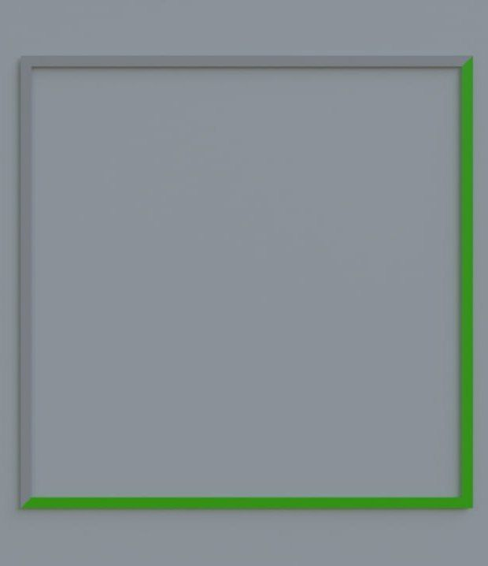
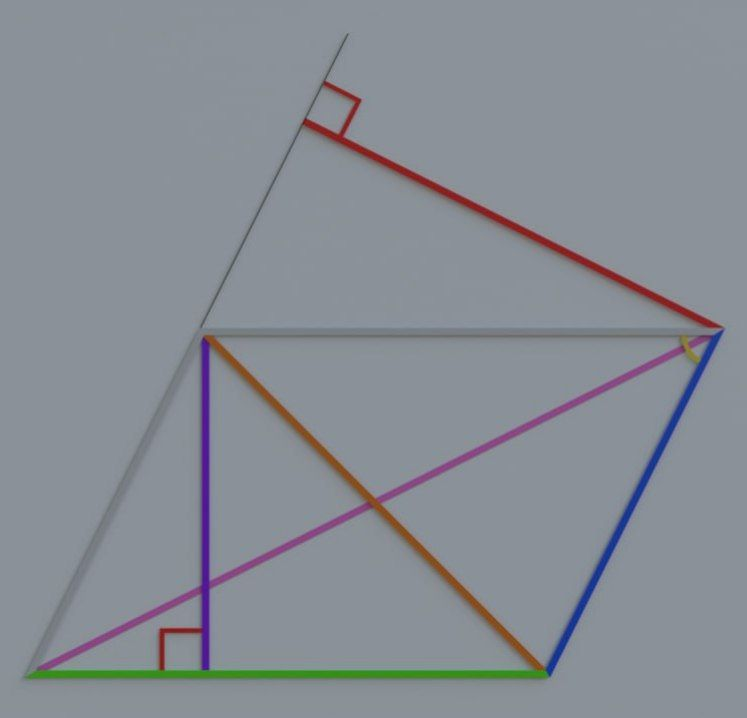
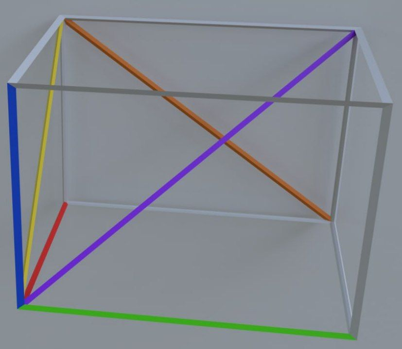
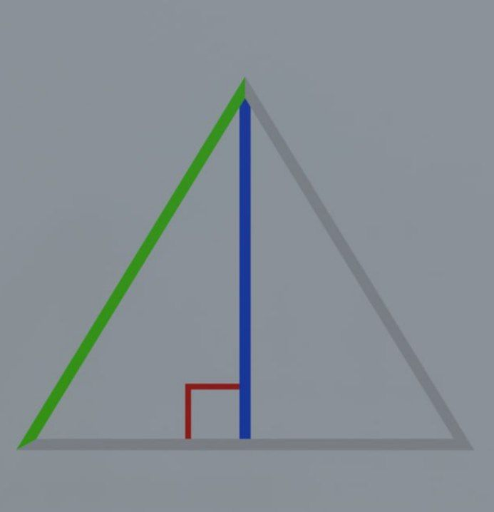
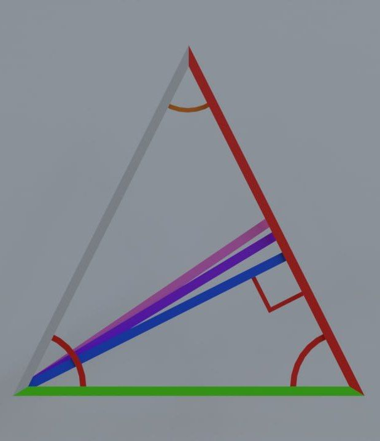
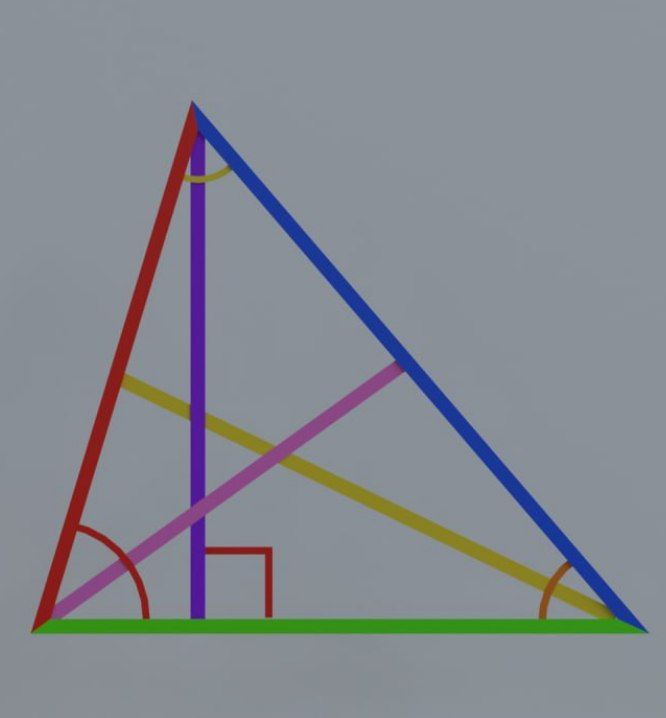
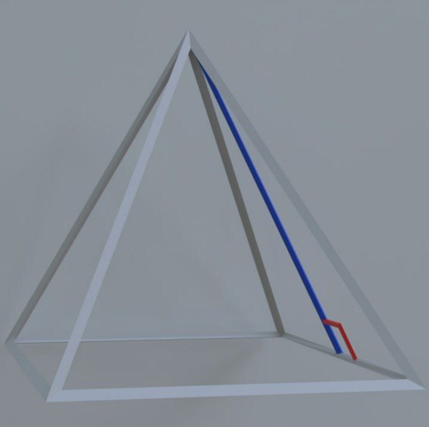
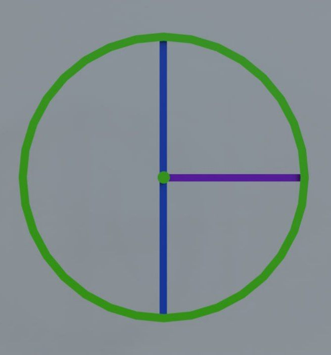

# Geometria

"Geometria" is a program to help to calculate basic parameters in simple figures :ballot_box_with_check:

<div style="text-align:center">
  
</div>
<!---->

___
## Short describtion and methods:
SDK: *corrnetto 11*;

---
### The head class `HelpingMethods`:
1. ```public double quadraticEducation(double a, double b, double c)``` - This is a function that calculates the root of a quadratic equation of the form `ax^2 + bx + c = 0` using the discriminant and variables.

```Return value```:
  + Returns the root of an equation if it exists and is positive;
  + If the discriminant is less than 0, the function will return -1 and display the message "Discriminant less than 0";
  + If the roots are negative, the function will also return -1 and display an error message.

2. ```public double round(double x, int dozen)``` - this is a function that rounds a number to a given tenth.
  + ```Variables```:
    + ```double x``` - the number to be rounded;
    + ```int dozen``` - the tenth to which the number should be rounded. Must be in the range -9 to 9.
  + ```Return value```:
    + Returns a number rounded to the specified tenth;
    + If the value of the dozen parameter is outside the range from -9 to 9, the function will display the message "Out of range" and return -1.
3. ```public double pythagoreanTheorem(double a, double b, char action)``` - this is a function that implements the Pythagorean theorem to calculate the length of the hypotenuse of a triangle or the difference of the legs depending on the specified operation.
  + ```Variables```:
    + ```double a``` - length of the first leg of the triangle;
    + ```double b``` - length of the second leg of the triangle;
    + ```char action``` - the operation to be performed. Can be '+' (to calculate the hypotenuse) or '-' (to calculate the difference between the legs).
  + ```Return value```:
    + Returns the result of an operation depending on the specified action;
    + If action is not '+' or '-', the function will print the message "Enter correct parameter." and will return -1.
4. ```public double pythagoreanTheorem(double a, char action)``` - this is a function that applies the Pythagorean theorem to calculate either the length of the hypotenuse of a triangle (the sum of the squares of the legs) or the difference of the legs, depending on the specified operation.
  + ```Variables```:
    + ```double a``` - the length of one of the legs of the triangle;
    + ```char action``` - The operation to be performed. Can be '+' (to calculate the length of the hypotenuse) or '-' (to calculate the difference between the legs).
  + ```Return value```:
    + Returns the result of an operation depending on the specified action;
    + If action is not '+' or '-', the function will print the message "Enter correct parameter." and will return -1.
---

### The package `rectangle`:
#### The 2D figures:
#### The head class ```Rectangle```:

<div style="text-align:center;">


<span style="color: blue;"><div style="text-align:center;">Designation of colors in a figure:</div></span>
<div style="text-align:center;">
  <span>color</span> :blue_heart:
  <span> - double width;</span>
</div>
<div style="text-align:center;">
  <span>color</span> :green_heart:
  <span> - double length;</span>
</div>
<div style="text-align:center;">
  <span>color</span> :purple_heart:
  <span> - double diagonal;</span>
</div>
<div style="text-align:center;">
  <span>color</span> :heart: 
  <span> - double corner;</span>
</div>
<div style="text-align:center;">
  <span>color</span> :peach:
  <span> - cornerDiagonalWidth();</span>
</div>
<div style="text-align:center;">
  <span>color</span> :yellow_heart:
  <span> - cornerDiagonalLength().</span>
</div>

</div>  

---

**Constructor`s overload** - ``Rectangle(double length, double width)``.

- ```double length``` - the main values that denotes the value of rectangle`s side;
- ```set[-Length, -Width, -Perimeter, -Area, -Diagonal, -OutRadius, -InputRadius, -Corner](double value)``` - methods which you should use to give values to parameters. For example ```setLength(3)```;
- ```area()``` - method which calculates the area of rectangle using ```double length``` and ```double width```;
- ```perimeter()``` - method which calculates the perimeter of rectangle using ```double length``` and ```double width```;
- ```diagonal()``` - method which calculates the diagonal of rectangle using ```double length``` and ```double width```;
- ```outRadius()``` - method which calculates the radius of out circle using ```double diagonal``` only if the rectangle corresponds to the conditions for the existence of such a circle;
- ```inputRadius()``` - method which calculates the radius of input circle using ```double length``` only if the rectangle corresponds to the conditions for the existence of such a circle;
- ```corner()``` - method which calculates the corner of rectangle;
- ```sumOfCorners()``` - method which calculates the sum of all corners in rectangle; 
- ```cornerDiagonal[-Length, -Width]``` - method which calculates the corner between the diagonal and particular side. For example ```cornerDiagonalLength()``` => *30*;
- ```double side(String parameter)``` - method which calculates the ```double width``` using ```double length``` and characteristic in dependence of parameter:
  - ```"a"``` - is the area of rectangle;
  - ```"p"``` - is the perimeter of rectangle;
  - ```"d"``` - is the diagonal of rectangle;
  - ```"i"``` - is the radius of input circle of rectangle;
  - ```"o"``` - is the radius of out circle of rectangle.

  If you enter another parameter, an error will occur.
___

  

#### The class ```Square```:
*Square extends Rectangle.*

<div style="text-align:center;">
 

<span style="color: blue;"><div style="text-align:center;">Designation of colors in a figure:</div></span>
<div style="text-align:center;">
  <span>color</span> :green_heart:
  <span> - double width.</span>
</div>

</div>  

---

**Constructor`s overload** - ``Square(double length)``.

+ ```setWidth(double value)``` - method outputs Error because all sides of a square are equal(`setWidth() == setLength()`), so we use only `setLength()`;
+ ```cornerDiagonalWidth()``` - method outputs Error because `cornerDiagonalWidth() == cornerDiagonalLength()`.
---


#### The class ```Parallelogram```:
*Parallelogram extends Rectangle.*

<div style="text-align:center;">


<span style="color: blue;"><div style="text-align:center;">Designation of colors in a figure:</div></span>
<div style="text-align:center;">
  <span>color</span> :blue_heart:
  <span> - double width;</span>
</div>
<div style="text-align:center;">
  <span>color</span> :green_heart:
  <span> - double length;</span>
</div>
<div style="text-align:center;">
  <span>color</span> :heartpulse:
  <span> - double diagonal1;</span>
</div>
<div style="text-align:center;">
  <span>color</span> :peach:
  <span> - double diagonal2;</span>
</div>

<div style="text-align:center;">
  <span>color</span> :purple_heart:
  <span> - double height1;</span>
</div>

<div style="text-align:center;">
  <span>color</span> :heart:
  <span> - double height2;</span>
</div>

<div style="text-align:center;">
  <span>color</span> :yellow_heart:
  <span> - double corner.</span>
</div>

</div>

---

**Constructor`s overload** - ``Parallelogram(double length, double width, double corner)``.

+ ```corner()``` - corner must be less than 90 degrees, otherwise it will not be a parallelogram;
+ ```diagonal()``` -  since a parallelogram is a derivative of a rectangle and if you enter a diagonal, it doesn't work. It means you need to use `diagonal1()` or `diagonal2()` using ```double leinght```,```double width``` and `double corner`;

+ ```outRadius()``` - a circle can be described around a square and a rectangle, that is, when equality `diagonal1() == diagonal2()` is fulfilled.The method using method `diagonal1()`;
+ ```inputRadius()``` - method, which using `double length`, `double width` and `area()`, works only when `double length == double width` otherwise, it is not possible to inscribe a circle in a parallelogram and find the radius;
+ ```double area(String parameter)``` - method which calculates the area of parallelogram using characteristic in dependence of parameter:
  + ```"h"``` - using `double height` and `double length`;
  + ```"c"``` - using `double width`, `double corner` and `double length`. 
  
  If you enter another parameter, an error will occur.  
---


#### The class ```Rhombus```:
*Rhombus extends Parallelogram.*


**Constructor`s overload** - ``Rhombus(double length, double corner)``.

+ ```setWidth(double value)``` - method outputs Error because all sides of a rhombus are equal(`setWidth() == setLength()`), so we use only `setLength()`;
<!--+ ```area()``` - the method works only by using parameters:
  + ```'h'``` - `double value` - calculation of the area using `double height` and `double length`;
  + ```'c'``` - `double value` - calculation or the area using `double length` and `double corner`;
  
  If you enter another parameter, an error will occur.-->
 + ```cornerDiagonalWidth()``` - the method produces an Error, because all sides of a rhombus are equal and we use the `double length`, and therefore the `cornerDiagonalLength()` method.
---
#### The 3D figures:
#### The class ```Cube```:
*Cube extends Square.*


**Constructor`s overload** - ``Cube(double length)``.

+ ```set[-Volume, -DiagonalV](double value)``` - methods which you should use to give values to parameters. For example ```setVolume(36)```;
+ ```volume()``` - method which calculates the volume of cube using `double length`;
+ ```diagonalV()``` - method which calculates the diagonal of cube using `double length`;
+ ```area()``` -  method which calculates the area of cube using `double length`;
+ ```perimeter(), inputRadius(), setPerimeter(), setInputRadius(), setOutRadius(), outRadius()``` - methods which doesn't exist in this class;
+ ```sumOfCorners()``` - method outputs "Error", because we can`t to calculate sum of corners in cube.
---
#### The class `Parallelepiped`:
*Parallelepiped extends Rectangle.*

<div style="text-align:center;">


<span style="color: blue;"><div style="text-align:center;">Designation of colors in a figure:</div></span>
<div style="text-align:center;">
  <span>color</span> :heart:
  <span> - double width;</span>
</div>

<div style="text-align:center;">
  <span>color</span> :green_heart:
  <span> - double length;</span>
</div>

<div style="text-align:center;">
  <span>color</span> :blue_heart:
  <span> - double heightP;</span>
</div>

<div style="text-align:center;">
  <span>color</span> :yellow_heart:
  <span> - double diagonalSideWidth;</span>
</div>

<div style="text-align:center;">
  <span>color</span> :peach:
  <span> - double diagonalSideLength;</span>
</div>

<div style="text-align:center;">
  <span>color</span> :purple_heart:
  <span> - double diagonalV.</span>
</div>

</div>  

---

**Constructor`s overload** - ``Parallelepiped(double length, double width, double heightP)``.

+ ```double heightP, double volume, double diagonalV, double diagonalSideLength, double diagonalSideWidth```- variables that will be used in methods;
+ ```volume()``` - method which calculates the volume of parallelepiped using `double length`, `double width`, `double heightP`;
+ ```diagonalV()``` - method which calculates the diagonal of parallelepiped using `double diagonal` and `double heightP`;
+ ```inputRadius(), setPerimeter(), setInputRadius(), setOutRadius(), outRadius()``` - methods which doesn't exist in this class;
+ ```sumOfCorners()``` - method which doesn't use in this class, because it is impossible to find the sum of corners in parallelepiped;
+ ```double heightP(String parameter)``` - method which calculates the volume height of parallelepiped in different ways using characteristic in dependence of parameter:
  + ```"a"``` - using `double area`, `double length` and `double width`;
  + ```"d"``` - using `double diagonalSideLength` and `double length`;
  + ```"dW"``` - using `double diagonalSideWidth` and `double width`;
  + ```"dV"``` - using `double diagonal` and `double diagonalV`;
  + ```"v"``` - using `double volume`, `double length` and `double width`.

  If you enter another parameter, an error will occur.
+ ```double length(String parameter)``` - method which calculates the length of parallelepiped in different ways using characteristic in dependence of parameter: 
  + ```"a"``` - using `double area`, `double heightP` and `double width`; 
  + ```"dL"``` - using `double diagonalSideLength` and `double heightP`;
  + ```"d"``` - using `double diagonal` and `double width`;
  + ```"dV"``` - using `double diagonalV` and `double diagonalSideWidth`;
  + ```"v"``` - using `double volume`, `double heightP` and `double width`.

  If you enter another parameter, an error will occur.
+ ```double width(String parameter)``` - method which calculates the length of parallelepiped in different ways using characteristic in dependence of parameter:
  + ```"a"``` - using `double area`, `double heightP` and `double length`;
  + ```"dW"``` - using `double diagonalSideWidth` and `double heightP`;
  + ```"d"``` - using `double diagonal` and `double length`;
  + ```"dV"``` - using `double diagonalV` and `double diagonalSideLength`;
  + ```"v"``` -  using `double volume`, `double heightP` and `double length`.

  If you enter another parameter, an error will occur.

--- 
#### The class `StraightPrismRhombus`:
*StraightPrismRhombus extends Rhombus.*

**Constructor`s overload** - ``StraightPrismRhombus(double length,double heightP, double corner)``.

+ ```double heightP, double volume, double diagonalV1, double diagonalV2, double diagonalSideLength``` - variables that will be used in methods;
+ ```volume()``` - method which calculates the volume of prism using `double length`, `double height1` and `double heightP`;
+ ```diagonalSideLength()    - method which calculates diagonal of edge of the prism (length * height) using `double length` and `double heightP`;
+ ```double area(String parameter)``` - method which calculates the area of prism in different ways using characteristic in dependence of parameter:
  + ```"l"``` - using `double height1`, `double heightP` and `double length`;
  + ```"c"``` - using `double corner`, `double length` and `double heightP`.

  If you enter another parameter, an error will occur.

+ ```diagonalV1(), diagonalV2()``` - methods which calculate diagonals in prism using `double heightP`, `double diagonal` and `double diagonal2`;
+ ```inputRadius(), setPerimeter(), setInputRadius(), setOutRadius(), outRadius()``` - methods which doesn't exist in this class;
+ ```sumOfCorners()``` - method which doesn't use in this class, because it is impossible to find the sum of corners in prism;
+ ```double heightP(String parameter)``` - method which calculates the volume height of prism in different ways using characteristic in dependence of parameter:
  + ```"a"``` - using `double area`, `double length` and `double height1`;
  + ```"dL"``` - using `double diagonalSideLength` and `double length`;
  + ```"dV1"``` - using `double diagonalV1` and `double diagonal`;
  + ```"dV2"``` - using `double diagonalV2` and `double diagonal2`;
  + ```"v"``` - using `double volume`, `double height1` and `double length`.

  If you enter another parameter, an error will occur.

+ ```double length(String parameter)``` - method which calculates the length of prism in different ways using characteristic in dependence of parameter:
  + ```"a"``` - using `double area`, `double heightP` and `double height1`;
  + ```"dL"``` - using `double diagonalSideLength` and `double heightP`;
  + ```"v"``` - using `double volume`, `double height1` and `double heightP`.

  If you enter another parameter, an error will occur.
---

#### The class `StraightPrismParallelogram`:
*StraightPrismParallelogram extends Parallelogram.*

**Constructor`s overload** - ``StraightPrismParallelogram(double length, double width, double heightP, double corner)``.

+ ```double heightP, double volume, double diagonalV1, double diagonalV2, double diagonalSideLength, double diagonalSideWidth``` - methods which doesn't exist in this class;
+ ```double volume(String parameter)``` - method which calculates the volume of prism in different ways using characteristic in dependence of parameter:
  + ```"l"``` - using  `double length`, `double height1` and `heightP`;
  + ```"w"``` - using `double width`, `double height2`, and `double heightP`. 
+ ```double area(String parameter)``` - method which calculates the area of prism in different ways using characteristic in dependence of parameter:
  + ```"l"``` - using `double length`, `double heightP`, `double width` and `double height1`; 
  + ```"w"``` - using `double length`, `double heightP`, `double width` and `double height2`;
  + ```"c"``` - using `double width`, `double length`, `double heightP` and `double corner`.

  If you enter another parameter, an error will occur.
+ ```diagonalV1(), diagonalV2()``` - methods which calculate diagonals of prism using `double heightP`, `double diagonal` and `double diagonal2`;
+ ```diagonalSideLength(), diagonalSideWidth() ``` - methods which calculate diagonals of edge of the prism (length/width * height) using `double heightP` and `double length`/`double width`;
+ ```inputRadius(), setPerimeter(), setInputRadius(), setOutRadius(), outRadius()``` - methods which doesn't exist in this class;
+ ```sumOfCorners()``` - method which doesn't use in this class, because it is impossible to find the sum of corners in prism;
+ ```double heightP(String parameter)``` - method which calculates the volume height of prism in different ways using characteristic in dependence of parameter:
  + ```"a"``` - using `double area`, `double length`, `double width` and `height1`;
  + ```"dL"``` - using `double diagonalSideLength` and `double length`;
  + ```"dW"``` - using `double diagonalSideWidth` and `double width`;
  + ```"dV1"``` - using `double diagonalV1` and `double diagonal`;
  + ```"dV2"``` - using `double diagonalV2` and `double diagonal2`;
  + ```"v"``` - using `double volume`, `double length` and `double height1`.

  If you enter another parameter, an error will occur.
+ ```double length(String parameter)``` - method which calculates the length of prism in different ways using characteristic in dependence of parameter:
  + ```"a"``` - using `double area`, `double width`, `double height1` and `double heightP`;
  + ```"dL"``` - using `double diagonalSideLength` and `double heightP`;
  + ```"v"```- using `double volume`, `double heightP` and `double height1`.

If you enter another parameter, an error will occur.
+ ```double width(String parameter)``` - method which calculates the width of prism in different ways using characteristic in dependence of parameter:
  + ```"a"``` - using `double area`, `double length`, `double heightP` and `double height1`;
  + ```"dW"``` - using `double diagonalSideWidth` and `double heightP`;
  + ```"v"``` - using `double volume`, `double heightP` and `double height2`.

If you enter another parameter, an error will occur.


---

### The package `triangle`:
#### The 2D figures:
#### The head class ```EquilateralTriangle```:

<div style="text-align:center;">


<span style="color: blue;"><div style="text-align:center;">Designation of colors in a figure:</div></span>
<div style="text-align:center;">
  <span>color</span> :green_heart:
  <span> - double a;</span>
</div>

<div style="text-align:center;">
  <span>color</span> :blue_heart:
  <span> - double height.</span>
</div>

</div>

---

**Constructor`s overload** - ``EquilateralTriangle(double a)``.

+ ```double a, double perimeter, double area, double median, double bisector, double height, double outRadius, double inputRadius``` - variables that will be used in methods;
+ ```set[-A, -Perimeter, -Area, -Median, -Bisector, -Height -OutRadius, -InputRadius, -Corner](double value)``` - methods which you should use to give values to parameters. For example `setA(6)`;
+ ```semiPerimeter()``` - calculation of the semi-perimeter using `double perimeter`;
+ ```setMedian(), setBisector()``` - these methods are designed to derive from this class, and it can't be used in this class. you should use `setHeight()`.
+ ```perimeter()``` -  method which calculates the perimeter of equilateral triangle using `double a`;
+ ```area()``` -  method which calculates the area of equilateral triangle using ```double a```;
+ ```height()``` - method which calculates the height of equilateral triangle using ```double a```;
+ ```outRadius()``` - method which calculates the radius of the circle of equilateral triangle using ```double a```;
+ ```inputRadius()``` - method which calculates the radius of the inscribed circle of equilateral triangle using ```double a```;
+ ```double side(String parameter)``` - method which calculates the ```double a``` using characteristic in dependence of parameter:
  + ```"a"``` - ```double value``` - using the `double outRadius`;
  + ```"p"``` - ```double value``` - using the `double inputRadius`;
  + ```"i"``` - ```double value``` - using the `double perimeter`;
  + ```"o"``` - ```double value``` - using the `double area`;
  + ```"h"``` - ```double value``` - using the `double height`.

  If you enter another parameter, an error will occur.

---
#### The class `IsoscelesTriangle`:
*IsoscelesTriangle extends EquilateralTriangle.*

<div style="text-align:center;">


<span style="color: blue;"><div style="text-align:center;">Designation of colors in a figure:</div></span>

<div style="text-align:center;">
  <span>color</span> :heart:
  <span> - double b;</span>
</div>

<div style="text-align:center;">
  <span>color</span> :blue_heart:
  <span> - double heightB;</span>
</div>

<div style="text-align:center;">
  <span>color</span> :purple_heart:
  <span> - double bisectorB;</span>
</div>

<div style="text-align:center;">
  <span>color</span> :heartpulse:
  <span> - double medianB;</span>
</div>

<div style="text-align:center;">
  <span>color</span> :peach:
  <span> - double cornerApex;</span>
</div>

<div style="text-align:center;">
  <span>color</span> :peach:
  <span> - double cornerSide.</span>
</div>

</div>  

---

**Constructor`s overload** - ``IsoscelesTriangle(double a, double b)``.

+ ```double b, double medianB, double bisectorB, double heightB, double cornerApex, double cornerSide``` - variables that will be used in methods;
+ ```set[-B, -MedianB, -BisectorB, -HeightB, -CornerApex, -CornerSide](double value)``` - methods which you should use to give values to parameters. For example `setMedianB(8)`;
+ ```medianB()``` - method which calculates the median of isosceles triangle using `double b` and `double a`;
+ ```heightB()``` - method which calculates the height of isosceles triangle using `double b`;
+ ```double area(String parameter)``` - method which calculates the area of isosceles triangle using characteristic in dependence of parameter:
  + ```"a"``` - using the `double height` and `double b`;
  + ```"b"``` - using the `double heightB` and `double a`.
+ ```double sideB(String parameter)``` - method which calculates the ```double b``` using characteristic in dependence of parameter:
  + ```"o"``` - using the `double outRadius`, `double area` and `double a`;
  + ```"i"``` - using the `double inputRadius`, `double semiPerimeter` and `double a`;
  + ```"p"``` - using the `double perimeter` and `double a`;
  + ```"a"``` - using the `double area` and `double height`;
  + ```"h"``` - using the `double a` and `double height`.

  If you enter another parameter, an error will occur.
---
#### The class `Triangle`:
*Triangle extends IsoscelesTriangle.*

<div style="text-align:center;">


<span style="color: blue;"><div style="text-align:center;">Designation of colors in a figure:</div></span>

<div style="text-align:center;">
  <span>color</span> :heart:
  <span> - double a;</span>
</div>

<div style="text-align:center;">
  <span>color</span> :blue_heart:
  <span> - double b;</span>
</div>

<div style="text-align:center;">
  <span>color</span> :green_heart:
  <span> - double c;</span>
</div>

<div style="text-align:center;">
  <span>color</span> :peach:
  <span> - double cornerA;</span>
</div>

<div style="text-align:center;">
  <span>color</span> :yellow_heart:
  <span> - double cornerC;</span>
</div>

<div style="text-align:center;">
  <span>color</span> :heart:
  <span> - double cornerB;</span>
</div>

<div style="text-align:center;">
  <span>color</span> :yellow_heart:
  <span> - double medianA;</span>
</div>

<div style="text-align:center;">
  <span>color</span> ::heartpulse::
  <span> - double bisectorB;</span>
</div>

<div style="text-align:center;">
  <span>color</span> :purple_heart:
  <span> - double heightC.</span>
</div>

</div> 

---

**Constructor`s overload** - ``Triangle(double a, double b, double c)``.

+ ```double c, double medianC, double heightC, double bisectorC, double cornerA, double cornerB, double cornerC``` - variables that will be used in methods;
+ ```setCornerSide(), setCornerApex()``` - methods which doesn't exist in this class;
+ ```medianA(), medianC()``` - method which calculates the median of triangle using `double b`, `double c` and `double a`;
+ ```heightA()``` - method which calculates the height of triangle using `double c` and `double cornerB`;
+ ```heightB()``` - method which calculates the height of triangle using `double a` and `double cornerC`; 
+ ```heightC()``` - method which calculates the height of triangle using `double b` and `double cornerA`;
+ ```double side(String parameter)``` - method which calculate the ```double a``` using characteristic in dependence of parameter:
  + ```"o"``` - using the `double outRadius`, `double area`, `double b` and `double c`; 
  + ```"i"``` - using the `double semiPerimeter`, `double inputRadius`,`double b` and `double c`;
  + ```"p"``` - using the `double perimeter`, `double b` and `double c`;
  + ```"a"``` - using the `double area`, `double height`;
  + ```"h"``` - using the `double height`, `double b` and `double c`;
  + ```"t"``` - using the `double cornerA`, `double b` and `double c`.

  If you enter another parameter, an error will occur.
 
+ ```double sideC(String parameter)``` - method which calculates the ```double c``` using characteristic in dependence of parameter:
  + ```"o"``` - using the `double outRadius`, `double area`, `double b` and `double a`;
  + ```"i"``` - using the `double semiPerimeter`, `double inputRadius`,`double b` and `double a`;
  + ```"p"``` - using the `double perimeter`, `double b` and `double a`;
  + ```"a"```  - using the `double area`, `double heightC`;
  + ```"h"``` - using the `double heightC`, `double b` and `double a`;
  + ```"t"``` - using the `double cornerC`, `double b` and `double a`.

  If you enter another parameter, an error will occur.

---
#### The class `RightTriangle`:
*RightTriangle extends Triangle.*

**Constructor`s overload** - ``RightTriangle(double a, double b, double c)``.

+ ```setHeight(), setHeightB()``` -  methods which doesn't exist in this class;
+ ```setCornerC()``` - You should to input only 90 degrees, because it is a constant in right triangle;
+ ```double area(String parameter)``` - method which calculates the area of right triangle using characteristic in dependence of parameter:
  + ```"s"``` - using the `double a`, `double b`;
  + ```"c"``` - using the `double heightC`, `double c`. 

  If you enter another parameter, an error will occur.
+ ```double side(String parameter)``` - method which calculates the `double a` of right triangle using characteristic in dependence of parameter:
  + ```"o"``` - using `HelpingMethods`, `double outRadius` and `double b`;
  + ```"m"``` - using `HelpingMthods`, `double medianC` and `double b`;
  + ```"p"``` - using `double perimeter`, `double b` and `double c`;
  + ```"a"``` - using `double area` and `double b`;
  + ```"t"``` - using `HelpingMethods`, `double c` and `double b`;
  + ```"sin"``` - using `double c` and `double cornerA`
  + ```"cos"``` - using `double c` and `double cornerB`;
  + ```"tan"``` - using `double b` and `double cornerA`;
  + ```"ctan"``` - using `double b` and `double cornerA`.

  If you enter another parameter, an error will occur.
+ ```double sideB(String parameter)``` - method which calculates the `double a` of right triangle using characteristic in dependence of parameter:
  + ```"o"``` - using `HelpingMethods`, `double outRadius` and `double a`;
  + ```"m"``` - using `HelpingMthods`, `double medianC` and `double a`;
  + ```"p"``` - using `double perimeter`, `double a` and `double c`;
  + ```"a"``` - using `double area` and `double a`;
  + ```"t"``` - using `HelpingMethods`, `double c` and `double a`;
  + ```"sin"``` - using `double c` and `double cornerB`
  + ```"cos"``` - using `double c` and `double cornerA`;
  + ```"tan"``` - using `double a` and `double cornerB`;
  + ```"ctan"``` - using `double a` and `double cornerA`.

  If you enter another parameter, an error will occur.
+ ```double sideC(String parameter)``` - method which calculates the `double a` of right triangle using characteristic in dependence of parameter:
  + ```"o"``` - using `double outRadius`;
  + ```"m"``` - using `double medianC`;
  + ```"p"``` - using `double perimeter`, `double b` and `double a`;
  + ```"t"``` - using `HelpingMethods`, `double a` and `double b`;
  + ```"sinA"``` - using `double a` and `double cornerA`
  + ```"cosA"``` - using `double b` and `double cornerA`;
  + ```"sinB"``` - using `double b` and `double cornerB`;
  + ```"cosB"``` - using `double a` and `double cornerB`.

  If you enter another parameter, an error will occur.

---

#### The 3D figures:
#### The class `StraightPrismEquilateralTriangle`:
*StraightPrismEquilateralTriangle extends EquilateralTriangle.*

**Constructor`s overload** - ``StraightPrismEquilateralTriangle(double a, double heightP)``.

+ ```double heightP, double volume``` - variables that will be used in methods;
+ ```setPerimeter(), setOutRadius(), setInputRadius()``` - methods which doesn't exist in this class;
+ ```double perimeter, double outRadius, double inputRadius``` - variables which doesn't exist in this class;
+ ```volume()``` - method which calculates the volume of prism using `double a` and `double heightP`;
+ ```area()``` - method which calculates the area of prism using `double a` and `double heightP`;
+ ```double heightP(String parameter)``` - method which calculates the volume height of prism using characteristic in dependence of parameter:
  + ```"a"``` - using `double area` and `double a`;
  + ```"v"``` - using `doube volume` and `double a`.

If you enter another parameter, an error will occur.
+ ```double side(String parameter)``` - method which calculates the side of prism using characteristic in dependence of parameter:
  + ```"a"``` - using `double area`, `double heightP` and `HelpingMethods`;
  + ```"v"``` - using `double volume` and `double heightP`.

  If you enter another parameter, an error will occur.
---
#### The class `RightPyramidEquilateralTriangle`:
*RightPyramidEquilateralTriangle extends EquilateralTriangle.*

<div style="text-align:center;">



<span style="color: blue;"><div style="text-align:center;">Designation of colors in a figure:</div></span>

<div style="text-align:center;">
  <span>color</span> :blue_heart:
  <span> - double slantHeight.</span>
</div>

</div> 

----

**Constructor`s overload** - ``RightPyramidEquilateralTriangle(double a)``.

+ ```double volume, double areaSide, double areaBase, double heightP, double slantHeight``` - variables that will be used in methods;
+ ```set[-Volume, -HeightP, -AreaSide, -AreaBase, -SlantHeight](double value)``` - methods which you should use to give values to parameters. For example: `setAreaSide(24)`;
+ ```setPerimeter(), setOutRadius(), setInputRadius()``` - methods which doesn't exist in this class;
+ ```double inputRadius, double outRadius, double perimeter``` - variables which doesn't exist in this class;
+ ```areaBase()``` - method which calculates the base area of pyramid using `double a`;
+ ```areaSide()``` - method which calculates the area of the sides of pyramid using `double a`;
+ ```volume()``` - method which calculates the volume of pyramid using `double areaBase` and `double heightP`;
+ ```area()``` - method which calculates the volume of pyramid using `double areaSide` and `double areaBase`;
+ ```heightP()``` - method which calculates the volume height  of pyramid using `double a` and `HelpingMethods`;
+ ```double side(String parameter)``` - method which calculates the side using characteristic in dependence of parameter:
  + ```"a"``` - using the `double area`;
  + ```"aS"``` - using the `double areaSide`;
  + ```"aB"``` - using the `double areaSide`;
  + ```"h"``` - using the `double height`;
  + ```"hP"``` - using the `double height`;
  + ```"v"``` - using the `double volume`.

  If you enter another parameter, an error will occur.

---
#### The class `StraightPrismIsoscelesTriangle`:
*StraightPrismIsoscelesTriangle extends IsoscelesTriangle.*

**Constructor`s overload** - ``StraightPrismIsoscelesTriangle(double a, double b, double heightP)``.

+ ```double heightP, double areaBase, double areaSide, double volume, double diagonalSideA, double diagonalSideB``` - variables that will be used in methods;
+ ```setPerimeter(), setOutRadius(), setInputRadius()``` - methods which doesn't exist in this class;
+ ```set[-Volume, -HeightP, -DiagonalSideA, -DiagonalSideB](double value)``` - methods which you should use to give values to parameters. For example `setDiagonalSideB(16)`;
+ ```volume()``` - method which calculates the volume of prism using `double areaBase` and `double heightP`;
+ ```double areaBase(String parameter)``` - method which calculates the base area of prism using characteristic in dependence of parameter:
  + ```"a"``` - using `double height` and `double b`;
  + ```"b"``` - using `double heightB` and `double a`.
+ ```areaSide()``` - method which calculates the area of the sides of prism using `double a`, `double heightP` and `double b`;
+ ```area()``` - method which calculates the area of prism using `double areaBase` and `double areaSide`;
+ ```double inputRadius, double outRadius, double perimeter``` - variables which doesn't exist in this class;
+ ```diagonalSideA()``` - method which calculates the diagonal of side A using `HelpingMethods`, `double a` and `double heightP`;
+ ```diagonalSideB()``` - method which calculates the diagonal of side B using `HelpingMethods`, `double b` and `double heightP`;
+ ```double heightP(String parameter)``` - method which calculates the volume height of prism using characteristic in dependence of parameter:
  + ```"v"``` - using `double volume` and `double areaBase`;
  + ```"aS"``` - using `double areaSide` and `double a`.

  If you enter another parameter, an error will occur.
+ ```double side(String parameter)``` - method which calculates the side of prism using characteristic in dependence of parameter:
  + ```"a"``` - using `HelpingMethods`, `double heightP` and `double area`;
  + ```"v"``` - using `double volume` and `double heightP`.

  If you enter another parameter, an error will occur.

---
#### The class `StraightPrismTriangle`:
*StraightPrismTriangle extends Triangle.*

**Constructor`s overload** - ``StraightPrismTriangle(double a, double b, double c, double heightP)``.

+ ```double volume, double areaSide, double areaBase, double heightP, double diagonalSideA, double diagonalSideB, double diagonalSideC``` - variables that will be used in methods;
+ ```set[-Volume, -AreaSide, -AreaBase, -HeightP, -DiagonalSideA, -DiagonalSideB, -DiagonalSideC](double value)``` - methods which you should use to give values to parameters. For example `setAreaBase(36)`;
+ ```setOutRadius(), setInputRadius()``` - methods which doesn't exist in this class;
+ ```double outRadius, double inputRadius, double side, double sideB, double sideC``` - variables which doesn't exist in this class;
+ ```double areaBase(String parameter)``` - method which calculates the base area of prism using characteristic in dependence of parameter:
  + ```"b"``` - using `double heightB` and `double b`;
  + ```"a"``` - using `double height` and `double a`;
  + ```"c"``` - using `double heightC` and `double c`;
  + ```"p"``` - using `double semiPerimeter`, `double a`, `double b` and `double c`.

  If you enter another parameter, an error will occur.
  + ```areaSide()``` - method which calculates the area of the sides of prism using `double heightP`, `double a`, `double b` and `double c`;
  + ```area()``` - method which calculates the area of prism using `double areaBase` and `double areaSide`;
  + ```volume()``` - method which calculates the volume of prism using `double areaBase` and `double heightP`;
  + ```diagonalSideA()``` - method which calculates the diagonal near side `double a` using `HelpingMethods`, `double heightP` and `double a`;
  + ```diagonalSideB()``` - method which calculates the diagonal near side `double b` using `HelpingMethods`, `double heightP` and `double b`;
  + ```diagonalSideC()``` - method which calculates the diagonal near side `double c` using `HelpingMethods`, `double heightP` and `double c`;
  + ```double heightP(String parameter)``` - method which calculates the volume height of prism using characteristic in dependence of parameter:
    + ```"aS"``` - using `double areaSide`, `double a`, `double b` and `double c`;
    + ```"a"``` - using `double area`,`double areaBase`, `double a`, `double b` and `double c`;
    + ```"v"``` - using `double volume` and `double areaBase`;
    + ```"dSA"``` - using `HeilpingMethods`, `double diagonalSideA` and `double a`;
    + ```"dSB"``` - using `HeilpingMethods`, `double diagonalSideB` and `double b`;
    + ```"dSC"``` - using `HeilpingMethods`, `double diagonalSideC` and `double c`.

  If you enter another parameter, an error will occur.
+ ```double side(String parameter)``` - method which calculates the `double a` of prism using characteristic in dependence of parameter:
  + ```"aBH"``` - ```double value``` - using `double areaBase` and `double height`;
  + ```"p"``` - ```double value``` - using `double perimeter`, `double b` and `double c`;
  + ```"v"``` - ```double value``` - using `double volume`, `double heightP` and `double height`;
  + ```"dSA"``` - ```double value``` - using `HelpingMethods`, `double diagonalSideA` and `double heightP`;
  + ```"t"``` - ```double value``` - using `double b`, `double c`, `HelpingMethods` and `double cornerA`;
  + ```"h"``` -```double value``` - using `HelpingMethods`, `double b`, `double c` and `double height`;
  + ```"m"``` - ```double value``` - using `double b`, `double c` and `double median`.

  If you enter another parameter, an error will occur.
+ ```double sideB(String parameter)``` - method which calculates the `double b` of prism using characteristic in dependence of parameter:
  + ```"aBH"``` - ```double value``` - using `double areaBase` and `double heightB`;
  + ```"p"``` - ```double value``` - using `double perimeter`, `double a` and `double c`;
  + ```"v"``` - ```double value``` - using `double volume`, `double heightP` and `double heightB`;
  + ```"dSA"``` - ```double value``` - using `HelpingMethods`, `double diagonalSideB` and `double heightP`;
  + ```"t"``` - ```double value``` - using `double a`, `double c`, `HelpingMethods` and `double cornerB`;
  + ```"h"``` -```double value``` - using `HelpingMethods`, `double a`, `double c` and `double heightB`;
  + ```"m"``` - ```double value``` - using `double a`, `double c` and `double medianB`.

  If you enter another parameter, an error will occur.
+ ```double sideC(String parameter)``` - method which calculates the `double c` of prism using characteristic in dependence of parameter:
  + ```"aBH"``` - ```double value``` - using `double areaBase` and `double heightC`;
  + ```"p"``` - ```double value``` - using `double perimeter`, `double b` and `double a`;
  + ```"v"``` - ```double value``` - using `double volume`, `double heightP` and `double heightC`;
  + ```"dSA"``` - ```double value``` - using `HelpingMethods`, `double diagonalSideC` and `double heightP`;
  + ```"t"``` - ```double value``` - using `double b`, `double a`, `HelpingMethods` and `double cornerC`;
  + ```"h"``` -```double value``` - using `HelpingMethods`, `double b`, `double a` and `double heightC`;
  + ```"m"``` - ```double value``` - using `double b`, `double a` and `double medianC`.

  If you enter another parameter, an error will occur.

---

#### The class `StraightPrismRightTriangle`:
*StraightPrismRightTriangle extends RightTriangle.*

**Constructor`s overload** - ``StraightPrismRightTriangle(double a, double b, double c, double heightP)``.

+ ```double volume, double areaSide, double areaBase, double heightP, double diagonalSideA, double diagonalSideB,double diagonalSideC``` - variables that will be used in methods;
+ ```set[-Volume, -AreaSide, -AreaBase, -HeightP, -DiagonalSideA, -DiagonalSideB, -DiagonalSideC]``` - methods which you should use to give values to parameters. For example `setDiagonalSideA(16)`;
+ ```setInputRadius(), setOutRadius()``` - methods which doesn't exist in this class;
+ ```double outRadius, double inputRadius, double side, double sideB, double sideC``` - variables which doesn't exist in this class;
+ ```double areaBase(String parameter)``` - method which calculates the base area of prism using characteristic in dependence of parameter:
  + ```"c"``` - using `double a` and `double b`;
  + ```"h"``` - using `double heightC` and `double c`.

  If you enter another parameter, an error will occur.
+ ```areaSide()``` - method which calculates the area of the sides of prism using `double heightP`, `double b`, `double c` and `double a`;
+ ```area()``` - method which calculates the area of prism using `double areaBase` and `double areaSide`;
+ ```volume()``` - method which calculates the volume of prism using `double areaBase` and `double heightP`;
+ ```diagonalSideA()``` - method which calculates the diagonal near side `double a` using `HelpingMethods`, `double heightP` and `double a`;
+ ```diagonalSideB()``` - method which calculates the diagonal near side `double b` using `HelpingMethods`, `double heightP` and `double b`;
+ ```diagonalSideC()``` - method which calculates the diagonal near side `double c` using `HelpingMethods`, `double heightP` and `double c`;
+ ```double heightP(String parameter)``` - method which calculates the volume height of prism using characteristic in dependence of parameter:
  + ```"aS"``` - using `double areaSide`, `double a`, `double b` and `double c`; 
  + ```"a"``` - using `double area`, `double areaBase`, `double a`, `double b` and `double c`;
  + ```"v"``` - using `double volume` and `double areaBase`;
  + ```"dSA"``` - using `HelpingMethods`, `double diagonalSideA` and `double a`;
  + ```"dSB"``` - using `HelpingMethods`, `double diagonalSideB` and `double b`;
  + ```"dSC"``` - using `HelpingMethods`, `double diagonalSideC` and `double c`.

  If you enter another parameter, an error will occur.
+ ```double side(String parameter)``` - method which calculates the `double a` using characteristic in dependence of parameter:
  + ```"aBH"``` - using `double areaBase` and `double b`;
  + ```"v"``` - using `double volume`,`double heightP` and `double b`;
  + ```"dSA"``` - using `HelpingMethods`, `double diagonalSideA` and `double heightP`;
  + ```"t"``` - using `HeplingMethods`, `double c` and `double b`;
  + ```"sin"``` - using `double c` and `double cornerA`;
  + ```"cos"``` - using `double c` and `double cornerB`;
  + ```"tan"``` - using `double b` and `double cornerA`;
  + ```"ctan"``` - using `double b` and `double cornerB`.

  If you enter another parameter, an error will occur.
+ ```double sideB(String parameter)``` - method which calculates the `double a` using characteristic in dependence of parameter:
  + ```"aBH"``` - using `double areaBase` and `double a`;
  + ```"v"``` - using `double volume`,`double heightP` and `double a`;
  + ```"dSB"``` - using `HelpingMethods`, `double diagonalSideB` and `double heightP`;
  + ```"t"``` - using `HeplingMethods`, `double c` and `double a`;
  + ```"sin"``` - using `double c` and `double cornerB`;
  + ```"cos"``` - using `double c` and `double cornerA`;
  + ```"tan"``` - using `double a` and `double cornerB`;
  + ```"ctan"``` - using `double a` and `double cornerA`.

  If you enter another parameter, an error will occur.
+ ```double sideC(String parameter)``` - method which calculates the `double a` using characteristic in dependence of parameter:
  + ```"aBH"``` - using `double areaBase` and `double heightC`;
  + ```"v"``` - using `double volume`,`double heightP` and `double heightC`;
  + ```"dSC"``` - using `HelpingMethods`, `double diagonalSideC` and `double heightP`;
  + ```"t"``` - using `HeplingMethods`, `double a` and `double b`;
  + ```"m"``` - using `double medianC`;
  + ```"sinA"``` - using `double a` and `double cornerA`;
  + ```"cosA"``` - using `double b` and `double cornerA`;
  + ```"sinnB"``` - using `double b` and `double cornerB`;
  + ```"cosB"``` - using `double a` and `double cornerB`.

  If you enter another parameter, an error will occur.


---
### The package `circle`:
#### The 2D figures:
#### The head class `Circle`:

<div style="text-align:center;">


<span style="color: blue;"><div style="text-align:center;">Designation of colors in a figure:</div></span>

<div style="text-align:center;">
  <span>color</span> :green_heart:
  <span> - double length;</span>
</div>

<div style="text-align:center;">
  <span>color</span> :blue_heart:
  <span> - double diameter;</span>
</div>

<div style="text-align:center;">
  <span>color</span> :purple_heart:
  <span> - double radius.</span>
</div>

</div>  

---

**Constructor`s overload** - ``Circle(double radius)``.

+ ```double radius, double diameter, double length, double area``` - variables that will be used in methods;
+ ```set[-Radius, -Diameter, -Length, -Area](double value)``` - methods which you should use to give values to parameters. For example `setDiameter(12)`;
+ ```diameter()``` - method which calculates the diameter of circle using `double radius`;
+ ```length()``` - method which calculates the length of circle using `double radius`;
+ ```area()``` - method which calculates the area of circle using `double radius`;
+ ```double radius(String parameter)``` - method which calculates the radius of circle using characteristic in dependence of parameter:
  + ```"d"``` - using the `double diameter`;.
  + ```"l"``` - using the `double length`;
  + ```"a"``` - using the `double area`.

  If you enter another parameter, an error will occur.
---
#### The 3D figures:
#### The class `Cone`:


**Constructor`s overload** - ``Cone(double radius, double heightP)``.

+ ```double volume, double areaSide, double areaBase, double hightP, double slantHeight``` - variables that will be used in methods;
+ ```set[-Volume, -HeightP, -AreaSide, -AreaBase, -SlantHeight](double value)``` - methods which you should use to give values to parameters. For example `setVolume(36`
+ ```areaBase()``` - method which calculates the base area of cone using `double radius`;
+ ```areaSide()``` - method which calculates the area of the sides of cone using `double radius` and `double slantHeight`;
+ ```area()``` - method which calculates the area of cone using `double areaSide` and `double areaBase`;
+ ```volume()``` - method which calculates the volume of cone using `double areaBase` and `heightP`;
+ ```slantHeight()``` - method which calculates the slant height of cone using `HelpingMethods`, `double heightP` and `double radius`;
+ ```double heightP(String parameter)``` - method which calculates the volume height of cone using characteristic in dependence of parameter:
  + ```"s"``` - using the `HelpingMethods`, `double slantHeight` and `double radius`;
  + ```"aS"``` - using the `HelpingMethods`, `double areaSide` and `double radius`;
  + ```"a"``` - using the `HelpingMethods`, `double area` and `double radius`.

  If you enter another parameter, an error will occur.
+ ```double radius(String parameter)``` - method which calculates the radius of cone using characteristic in dependence of parameter:
  + ```"s"``` - using the `HelpingMethods`, `double slantHeight` and `double heightP`;
  + ```"aS"``` - using the `double areaSide` and `double slantHeight`;
  + ```"a"``` - using the `HelpingMethods`, `double slantHeight` and `double area`;
  + ```"aB"``` - using the `double areaBase`.

  If you enter another parameter, an error will occur.

---

#### The class `Sphere`:
*Sphere extends Circle.*

**Constructor`s overload** - ``Sphere(double radius)``.

+ ```double volume``` - variables that will be used in methods;
+ ```area()``` - method which calculates area of sphere using `double radius`;
+ ```volume()``` - method which calculates volume of sphere using `double radius`.
---

Project participants:
- [Alexandr Mykhailov](https://github.com/fxckAlice);
- [Polina Kovdrysh](https://github.com/pkovdrysh);
- :shipit: - squirrel).
